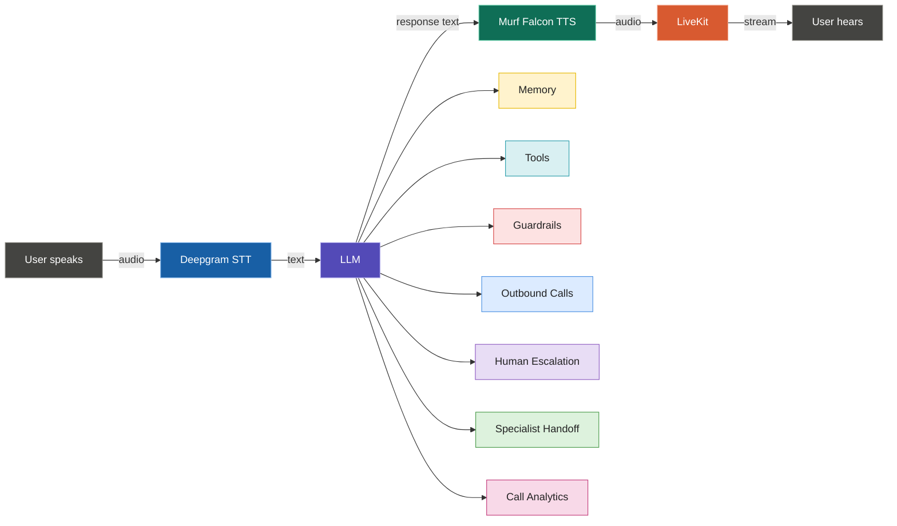

# 🇮🇳 Bharat Finance Assistant

**Bharat Finance Assistant** is a voice-first AI assistant built during the **10 Days of Voice Agents — VoiceForBharat Edition** challenge.

It helps users interact naturally through voice for financial guidance and government-scheme related queries, with support for memory, tools, human escalation, specialist handoffs, outbound calls, and call analytics.

## ✨ Features

* 🎙️ **Voice conversations** with an Indian voice powered by **Murf Falcon**
* 🧠 **User memory** for returning users
* 🛠️ **Tools** for retrieving and processing useful information
* 🌐 **Indian-language and code-mixed conversations**
* 🛡️ **Safety guardrails** for responsible responses
* 📞 **Outbound calling**
* 👤 **Human escalation** when AI assistance is not enough
* 🤝 **Specialist-agent handoffs**
* 📊 **Call analytics** for tracking call outcomes
* 💻 **Real-time voice interface** powered by LiveKit

## 🏗️ Architecture

```text
                    ┌──────────────────┐
                    │       User       │
                    │   🎙️ Speaks      │
                    └────────┬─────────┘
                             │
                             ▼
                    ┌──────────────────┐
                    │ Speech-to-Text   │
                    │      (STT)       │
                    └────────┬─────────┘
                             │
                             ▼
                    ┌──────────────────┐
                    │     LiveKit      │
                    │   Voice Agent    │
                    └────────┬─────────┘
                             │
                             ▼
                    ┌──────────────────┐
                    │       LLM        │
                    │ Reasoning & Flow │
                    └───────┬──────────┘
                            │
              ┌─────────────┼─────────────┐
              ▼             ▼             ▼
         ┌─────────┐   ┌─────────┐   ┌────────────┐
         │ Memory  │   │  Tools  │   │ Guardrails │
         └─────────┘   └─────────┘   └────────────┘
                            │
                            ▼
                    ┌──────────────────┐
                    │  Murf Falcon TTS │
                    └────────┬─────────┘
                             │
                             ▼
                    ┌──────────────────┐
                    │       User       │
                    │   🔊 Listens     │
                    └──────────────────┘
```




## The agent also supports:

```text
Voice Agent
     │
     ├──► Human Escalation
     │
     ├──► Specialist Agent Handoff
     │
     ├──► Outbound Calls
     │
     └──► Call Analytics
```

## 🧰 Tech Stack

* **Python**
* **TypeScript**
* **LiveKit** — real-time voice communication
* **Murf Falcon** — text-to-speech
* **LLM** — conversation reasoning
* **Speech-to-Text** — voice input processing
* **Database** — user memory and call records
* **Telephony** — outbound calling and call routing

## 🚀 Getting Started

### Prerequisites

Make sure you have:

* Python 3.10+
* Node.js
* pnpm
* LiveKit account/project
* Required API credentials

### 1. Clone the repository

```bash
git clone https://github.com/ZikraRahman/murf-livekit-starter.git
cd murf-livekit-starter
```

### 2. Install dependencies

Install the backend dependencies using the project's Python environment and install the frontend dependencies with pnpm.

```bash
pnpm install
```

For the backend, follow the dependency setup used by the project.

### 3. Configure environment variables

Create your local environment file and add your API credentials there.

**Never commit `.env` files, API keys, phone numbers, caller information, or other private data to GitHub.**

Example:

```env
LIVEKIT_URL=your_livekit_url
LIVEKIT_API_KEY=your_livekit_api_key
LIVEKIT_API_SECRET=your_livekit_api_secret
MURF_API_KEY=your_murf_api_key
```

Use the environment variables required by your local configuration.

### 4. Run the application

Start the backend voice agent and frontend using the project's development commands.

Then open the frontend locally and connect to the assistant.

## 🧪 Testing

After starting the application, test:

1. A normal voice conversation
2. A returning-user conversation to verify memory
3. A tool-based request
4. Human escalation
5. Specialist-agent handoff
6. Outbound calling
7. Call analytics

## 🔐 Security

This project is intended for development and demonstration purposes.

Do **not** expose:

* API keys
* `.env` files
* Phone numbers
* Caller information
* User IDs containing private information
* Database credentials
* Other sensitive data

Keep secrets in local environment variables and make sure `.gitignore` excludes sensitive files.

## 📖 Project Journey

I documented the complete 10-day build journey, including the architecture, features, challenges, and lessons learned.

**Blog:**
https://dev.to/zikra_22793c253593bf9c05a/from-a-voice-agent-to-a-voice-assistant-for-bharat-my-10-day-voiceforbharat-journey-11b6

## 🎥 Demo

**Demo video:**
*All demo videos are uploaded on LinkedIn.*

**LinkedIn:** https://www.linkedin.com/in/zikra-rahman-ab32263bb/

## 🙌 Acknowledgements

Built as part of **10 Days of Voice Agents — VoiceForBharat Edition**.

Special thanks to **Murf AI** for the challenge and for providing the voice technology powering the project.

